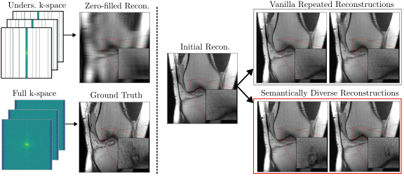

# Semantically Diverse Reconstructions (SDR)

Official implementation of our MICCAI 2025 paper: 

**"Mind the Detail: Uncovering Clinically Relevant Image Details in Accelerated MRI with Semantically Diverse Reconstructions"**



## 🔗 Paper

[Mind the Detail: Uncovering Clinically Relevant
Image Details in Accelerated MRI with
Semantically Diverse Reconstructions](https://arxiv.org/abs/2507.00670)

## 📂 Repository Structure

```plaintext
.
├── README.md
├── requirements.txt
├── yolo_functions        # Functions for YOLO format conversion
├── detectron2            # Detectron2 functions for object detection
├── fastmri-plus          # fastMRI-Plus annotations
├── vit_config            # Configuration file for ViT model
├── data                  # Infos about data and splits; dataset
├── physics               # Physics functions for MRI reconstruction
├── config.yaml           # Set paths for fastMRI and initial reconstructions
├── demo.py               # Demo script to run the model
```

## 🚀 Getting Started

### Clone the repository
```bash
  git clone --recursive https://github.com/NikolasMorshuis/SDR
  cd SDR
```

### Install dependencies
You can create a virtual environment:
```bash
  python -m venv venv
  source venv/bin/activate  # On Windows use venv\Scripts\activate
```
Then install the required packages:
```bash
  pip install -r requirements.txt
```

### Download models and sample data
You can download the pre-trained models and example data using:
```bash
  wget --content-disposition -P ./models "https://nc.mlcloud.uni-tuebingen.de/index.php/s/85eWEAbm8S2yWLS/download"
  wget --content-disposition -P ./models "https://nc.mlcloud.uni-tuebingen.de/index.php/s/GAS9fGAdZsBKQfJ/download"
  wget -O sample_data.zip "https://nc.mlcloud.uni-tuebingen.de/index.php/s/6LF8Wpt93NfDwGN/download"
  unzip sample_data.zip
  unzip sample_data/fastMRI.zip -d sample_data/
  rm sample_data.zip
  rm sample_data/fastMRI.zip
```

### Prepare the format of the fastmri-plus annotations
This will create a new folder `labels_yolo_knee` containing the annotations in the YOLO format, located in `./data`
```bash
  python yolo_functions/fastmri_plus.py
```

### Run the demo
You can run the demo with the following command:
```bash
  python demo.py --acc_factor 12 --debug
```

### Use your own data
You can use your own fastmri data and your own initial reconstructions. Just set the paths in `config.yaml` and run the demo script as shown above.


## Acknowledgements
This project uses some functionalities from the following repositories:
- [DDIP3D](https://github.com/hyungjin-chung/DDIP3D)
- [Detectron2](https://github.com/facebookresearch/detectron2)
- [CSGM-MRI-Langevin](https://github.com/utcsilab/csgm-mri-langevin)
- [Robust CLIP](https://github.com/chs20/RobustVLM)
- [fastMRI](https://github.com/facebookresearch/fastMRI)
- [fastMRI-Plus](https://github.com/microsoft/fastmri-plus)

Thanks to the authors for their great work and for making their code available!

## Citation
If you find this work useful, please cite our paper:

```bibtex
@misc{morshuis2025sdr,
      title={Mind the Detail: Uncovering Clinically Relevant Image Details in Accelerated MRI with Semantically Diverse Reconstructions}, 
      author={Jan Nikolas Morshuis and Christian Schlarmann and Thomas Küstner and Christian F. Baumgartner and Matthias Hein},
      year={2025},
      eprint={2507.00670},
      archivePrefix={arXiv},
      primaryClass={eess.IV},
      url={https://arxiv.org/abs/2507.00670}, 
}
```
